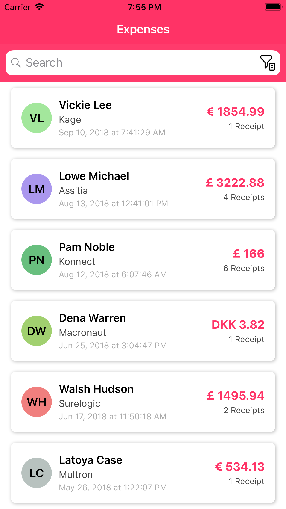
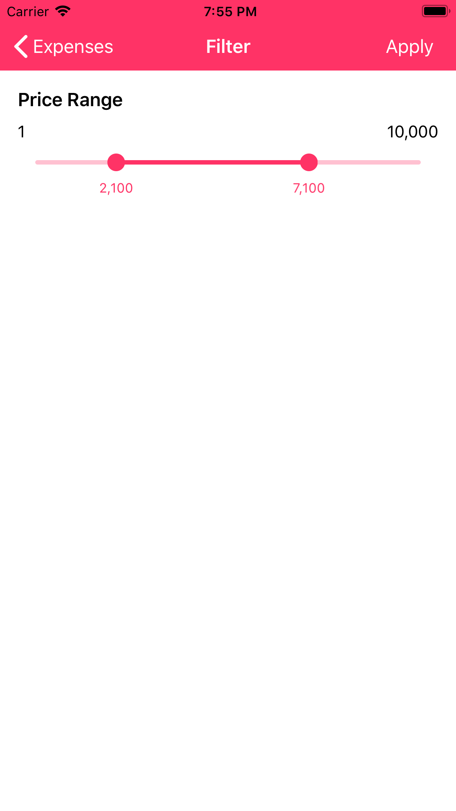
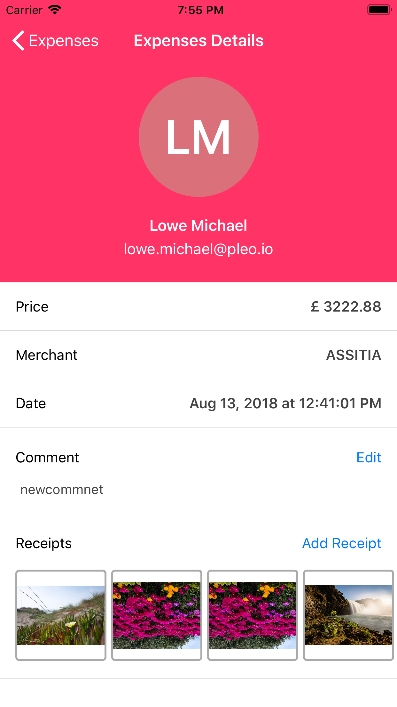

# ExpenseManager
ExpenseManager app is showing the user's expense list with date, amount and merchant name. User also apply the price filter on expense list and search on it. In details screen it is showing full details of expense, user can add comment and show expense receipt.

## [Video](https://github.com/iosdeveloper-portfolio/ExpenseManager/raw/master/Screenshorts/AppVideo.MP4)

## Screenshots

## Requirements

- iOS 10.0+
- Xcode 10.2+
- Swift 5.0+

## Installation

- Open terminal and use below command to install cocoapod
- sudo gem install cocoapods

## Dependencies

[Alamofire](https://github.com/Alamofire/Alamofire) :- We use Alamofire to perform basic networking tasks like uploading files and requesting data from a third-party RESTful API. This property determines the maximum number of simultaneous connections made to each host by tasks within sessions based on this configuration. 
Networking in Alamofire is done asynchronously. Asynchronous programming may be a source of frustration to programmers unfamiliar with the concept, but there are [very good reasons](https://developer.apple.com/library/ios/qa/qa1693/_index.html) for doing it this way.

[AlamofireNetworkActivityIndicator](https://github.com/Alamofire/AlamofireNetworkActivityIndicator) :- Controls the visibility of the network activity indicator on iOS using Alamofire.

[DTPhotoViewerController](https://github.com/tungvoduc/DTPhotoViewerController) :- Displaying multiple receipt image on full screen mode. It's fully customizable photo viewer ViewController to display single photo or collection of photos.

[SDWebImage](https://github.com/SDWebImage/SDWebImage) :- This library provides an async image downloader with cache support.

[RangeSeekSlider](https://github.com/WorldDownTown/RangeSeekSlider) :- RangeSeekSlider is use in filter section to filter price on particular range

[RappleProgressHUD](https://github.com/rjeprasad/RappleProgressHUD):- RappleProgressHUD is use to display process of image uploading or API calling.
